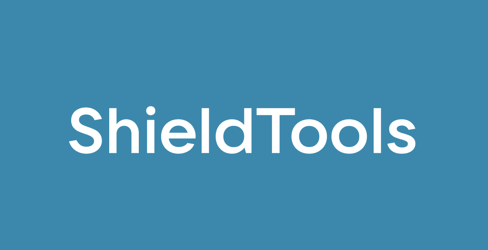

# ShieldTools

ShieldTools is a Russian-language Telegram bot for quick security checks.

It can:

- check messages for common scam patterns
- generate passwords and rate their strength
- look up DNS records, domain age, and SSL certificate details
- show location and provider information for an IP address
- check links with Google Safe Browsing and Kaspersky OpenTIP
- scan files with Kaspersky OpenTIP
- check email addresses with DNS and Stop Forum Spam
- encrypt and decrypt files with AES-256-GCM



## Setup

Python 3.10 or newer is required.

```bash
git clone <repository-url>
cd <repository-name>

python3 -m venv .venv
source .venv/bin/activate
python -m pip install -r requirements.txt

cp .env.example .env
```

On Windows, activate the environment and copy the config with:

```powershell
py -m venv .venv
.venv\Scripts\Activate.ps1
Copy-Item .env.example .env
```

Open `.env` and add your Telegram bot token:

```env
TG_BOT_TOKEN=your_token_here
```

The token can be created with [@BotFather](https://t.me/BotFather).

Start the bot:

```bash
python main.py
```

Then open it in Telegram and send `/start`.

## Optional API keys

The bot works with only `TG_BOT_TOKEN`, but some checks need their own API keys.

| Variable | Used for |
| --- | --- |
| `GOOGLE_SAFE_BROWSING_API_KEY` | Link checks |
| `TWO_IP_API_TOKEN` | Domain blocklist checks |
| `KASPERSKY_OPENTIP_API_KEY` | Domain and file checks |
| `OPENROUTER_API_KEY` | AI analysis |
| `GROQ_API_KEY` | AI analysis |
| `GEMINI_API_KEY` | AI analysis |
| `MISTRAL_API_KEY` | AI analysis |
| `HUGGINGFACE_API_KEY` | AI analysis |

You only need one AI provider. If none is configured, message checks fall back to local rules.

Do not upload `.env` to GitHub. It may contain private tokens and is already listed in `.gitignore`.

## Notes

A clean result does not prove that a message, link, or file is safe. Files submitted for scanning are sent to Kaspersky OpenTIP. AI checks send the provided text or scan result to the first configured provider that responds.

Encrypted files use the `.shield` extension. The password is not stored, so a lost password cannot be recovered.
